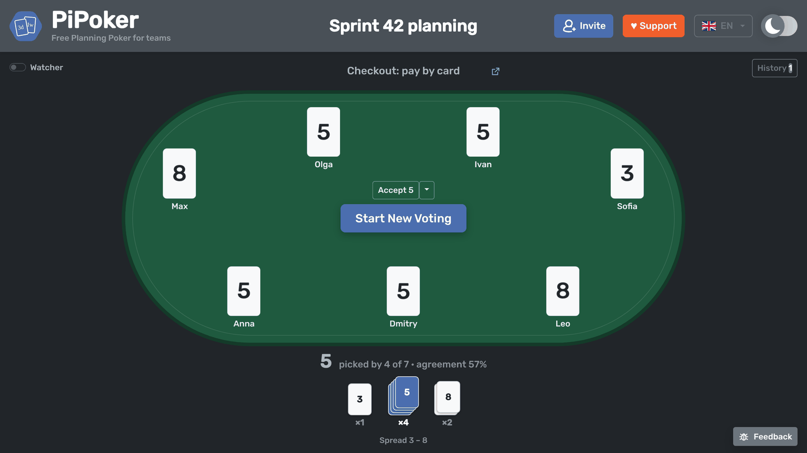
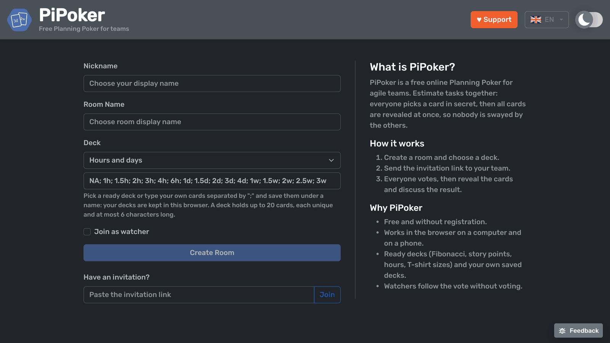
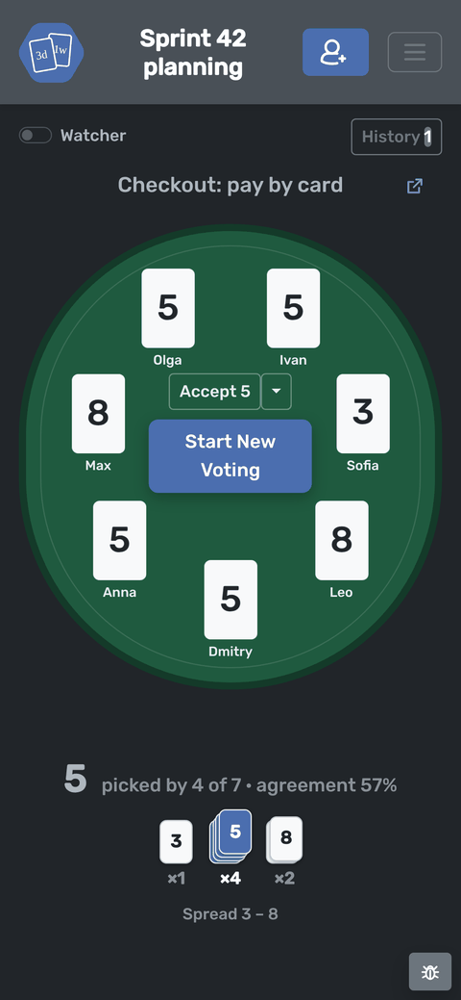
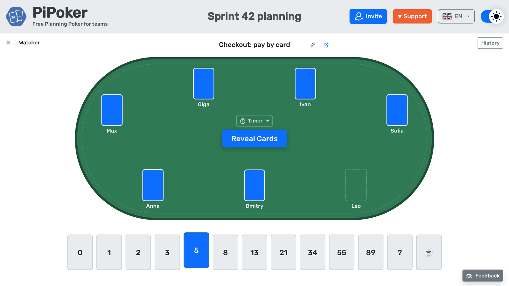
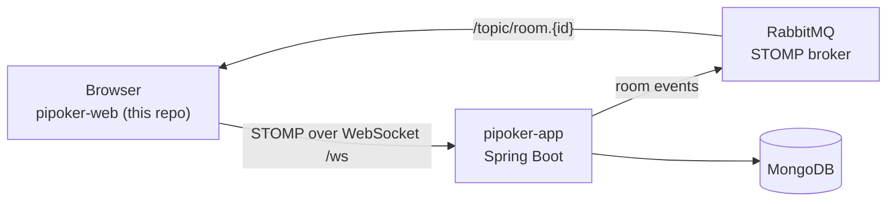
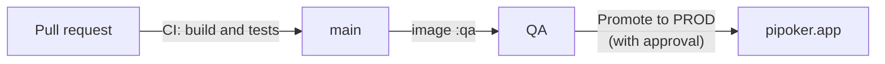

<div align="center">


# PiPoker

**Free online Planning Poker for agile teams. No sign-up, works in any browser.**

[**pipoker.app**](https://pipoker.app/?from=github) &nbsp;·&nbsp;
[Backend](https://github.com/LordDetson/pipoker-app) &nbsp;·&nbsp;
[Server setup](https://github.com/LordDetson/pipoker-docker-config)

[](https://github.com/LordDetson/pipoker-web/actions/workflows/ci.yml)
[](https://pipoker.app/?from=github)
[](LICENSE)


[](https://lorddetson.github.io/)



</div>

## What it is

A team opens a room, shares the invitation link, and everyone picks a card in secret. When the last voter has
picked, the cards turn over together, so nobody is swayed by the others. PiPoker then shows which estimate the
team agrees on and how far apart the votes are.

This repository is the web client. It talks to [pipoker-app](https://github.com/LordDetson/pipoker-app) over
STOMP on WebSocket, so every change in the room reaches everyone at once.

## Features

|  |  |
|---|---|
| 🚪 **Rooms without registration** | Create a room, send the link, and people join as voters or watchers. Anyone can switch between the two at any time. |
| ⚡ **Live votes** | Everyone sees who has voted. The cards are revealed together, by a button or as soon as the last voter has picked. |
| 📊 **Clear result** | Piles of cards in deck order, the leading estimate with the share of votes for it, and the spread. One click accepts the final estimate. |
| 📝 **Task per round** | Name the task being estimated and attach its link. |
| ⏱️ **Discussion timer** | A shared countdown from 1 to 10 minutes with a sound at the end. |
| 🃏 **Card decks** | Fibonacci, story points, hours and days, T-shirt sizes, or your own deck saved in the browser. |
| 🗂️ **Estimate history** | The last rounds in a side panel. Download them as Excel, CSV, text or XML, or copy a meeting summary in one click. |
| 🔄 **Reliable presence** | A page refresh keeps your seat, closing the tab frees it at once, and a lost connection reconnects by itself. |
| 📱 **Any screen** | Laptop, tablet or phone. Chrome and Edge can install PiPoker as an app with its own window. |
| 🌗 **Light and dark, Russian and English** | The language follows the browser; both the language and the theme can be switched in the header. |
| 💬 **Feedback from the room** | Report a problem or suggest an idea without leaving the page. |

<table>
  <tr>
    <td></td>
    <td rowspan="2" width="240"></td>
  </tr>
  <tr>
    <td></td>
  </tr>
</table>

## How it fits together



The client is an Angular application with NgRx: the room lives in the store, effects send commands to
`/app/room/...`, and the room's events from `/topic/room.{roomId}` update the store.

## Getting started

You need **Node.js 24**.

```bash
npm ci
npm start          # http://localhost:4200
```

The development server expects the backend on http://localhost:8080 (see `src/env/env.ts`); the quickest way to
run one is `server/compose.yml` in [pipoker-docker-config](https://github.com/LordDetson/pipoker-docker-config).
The production build (`npm run build`) connects to `/ws` on the domain it is served from. It also renders the start
page and the guide to HTML (`index.html`, `guide/index.html`, see `src/app/app.routes.server.ts`), so search engines
that run no JavaScript see their content; the other pages start from `index.csr.html`.

## Tests

```bash
npx ng test --watch=false --code-coverage   # add --browsers=ChromeHeadlessCI where there is no display
```

The coverage report is written to `coverage/pipoker-web`.

- **Unit tests** sit next to the code they test: services, NgRx reducers, selectors and effects, and every component.
- **Integration tests** in `src/app/integration` run the whole client (components, store, effects and services)
  against an in-memory imitation of the pipoker-app STOMP API from `src/app/testing/fake-stomp.ts`.
  Only the STOMP connection is replaced, so no backend is needed.
- **Live end-to-end tests** with Playwright, Safari and iPhone included, live in
  [pipoker-docker-config](https://github.com/LordDetson/pipoker-docker-config/tree/main/e2e).

## Releases



GitHub Actions ([`ci.yml`](.github/workflows/ci.yml)) builds and tests every pull request. Every push to main
also publishes the image `ghcr.io/lorddetson/pipoker-web`, which the QA environment picks up within a few
minutes. A commit checked on QA goes to PROD through the **Promote to PROD** workflow
([`promote.yml`](.github/workflows/promote.yml)), which waits for approval and then publishes a
[release](../../releases) named after the day, with the pull requests that went to PROD.

## Contributing

Ideas, bug reports and pull requests are welcome. Open an [issue](https://github.com/LordDetson/pipoker-web/issues)
or use the **Feedback** button on [pipoker.app](https://pipoker.app/?from=github). If PiPoker helps your team, you can
[support its development](https://lorddetson.github.io/).

## License

PiPoker is released under the [Apache License 2.0](LICENSE).
